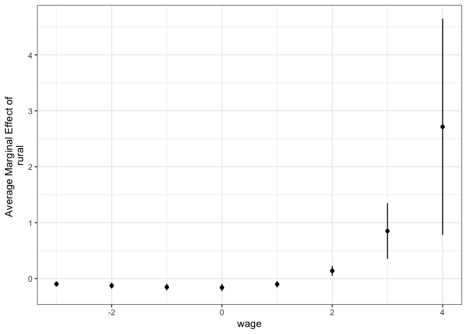

<!-- README.md is generated from README.Rmd. Please edit that file -->

# margins.pglm

[](https://www.tidyverse.org/lifecycle/#experimental)

The goal of `margins.pglm` is to replicate the function of [{ margins
}](https://github.com/leeper/margins), with models fitted with [{ pglm
}](https://cran.r-project.org/web/packages/pglm/index.html).

## Installation

``` r
devtools::install_github("benjaminguinaudeau/margins.pglm")
```

## Short Example

``` r
library(pglm)
#> Loading required package: maxLik
#> Loading required package: miscTools
#> 
#> Please cite the 'maxLik' package as:
#> Henningsen, Arne and Toomet, Ott (2011). maxLik: A package for maximum likelihood estimation in R. Computational Statistics 26(3), 443-458. DOI 10.1007/s00180-010-0217-1.
#> 
#> If you have questions, suggestions, or comments regarding the 'maxLik' package, please use a forum or 'tracker' at maxLik's R-Forge site:
#> https://r-forge.r-project.org/projects/maxlik/
#> Loading required package: plm
library(margins.pglm)
```

``` r

formula <- union ~ exper + wage*rural

anb <- pglm(formula, union_wage, family = binomial('probit'), 
            model = "pooling", method = "bfgs", print.level = 3, R = 5)
#> Initial function value: -2422.802 
#> Initial gradient value:
#>   (Intercept)         exper          wage      ruralyes wage:ruralyes 
#>  5.684342e-14  1.026742e+02  2.451840e+02 -6.714318e+00  7.466466e+01 
#> initial  value 2422.801633 
#> iter   2 value 2422.079377
#> iter   3 value 2402.640245
#> iter   4 value 2375.548189
#> iter   5 value 2375.118256
#> iter   6 value 2370.050793
#> iter   7 value 2363.200492
#> iter   8 value 2363.174156
#> iter   9 value 2363.174088
#> iter   9 value 2363.174088
#> iter   9 value 2363.174088
#> final  value 2363.174088 
#> converged
```

``` r
summary(margins::margins(model = anb, formula = formula))
#>    factor     AME     SE       z      p   lower  upper
#>     exper -0.0041 0.0039 -1.0589 0.2897 -0.0117 0.0035
#>  ruralyes  0.0641 0.0324  1.9784 0.0479  0.0006 0.1275
#>      wage  0.2192 0.0231  9.4742 0.0000  0.1739 0.2646
```

``` r
m <- margins::margins(model = anb, at = list("wage" = c(-3:4)), variables = "rural", formula = formula)
m
#> Average marginal effects at specified values
#> pglm(formula = formula, data = union_wage, model = "pooling",     family = binomial("probit"), R = 5, method = "bfgs", print.level = 3)
#>  at(wage) ruralyes
#>        -3 -0.09676
#>        -2 -0.12503
#>        -1 -0.15173
#>         0 -0.15946
#>         1 -0.10155
#>         2  0.13944
#>         3  0.84956
#>         4  2.71363
```

``` r
summary(m)
#>    factor    wage     AME     SE       z      p   lower   upper
#>  ruralyes -3.0000 -0.0968 0.0242 -3.9995 0.0001 -0.1442 -0.0493
#>  ruralyes -2.0000 -0.1250 0.0275 -4.5387 0.0000 -0.1790 -0.0710
#>  ruralyes -1.0000 -0.1517 0.0308 -4.9257 0.0000 -0.2121 -0.0914
#>  ruralyes  0.0000 -0.1595 0.0332 -4.7967 0.0000 -0.2246 -0.0943
#>  ruralyes  1.0000 -0.1015 0.0296 -3.4249 0.0006 -0.1597 -0.0434
#>  ruralyes  2.0000  0.1394 0.0451  3.0896 0.0020  0.0510  0.2279
#>  ruralyes  3.0000  0.8496 0.2542  3.3415 0.0008  0.3512  1.3479
#>  ruralyes  4.0000  2.7136 0.9861  2.7518 0.0059  0.7809  4.6464
```

``` r
library(ggplot2)
ggplot(aes(x = wage, y = AME, ymin = lower, ymax = upper), data = summary(m)) +
  geom_point() +
  geom_linerange() +
  labs(y = "Average Marginal Effect of \nrural") +
  theme_bw()
```


